# POD Flutter

[](https://flutter.dev)
[](#requirements)
[](LICENSE)

A cross-platform MIDI controller for the Line 6 POD XT Pro guitar processor.

**This is a Flutter spinoff of [pod-ui](https://github.com/arteme/pod-ui)** (by [arteme](https://github.com/arteme)), reimagined with a **quasi-skeumorphic interface** that mimics the actual POD hardware. While the original pod-ui takes a lean, lightweight "all-in-one-screen" approach, POD Flutter focuses on an authentic hardware-like experience with rotary knobs, LCD displays, and physical-style controls.

Control all parameters, manage patches, and sync with your POD XT Pro hardware via USB or Bluetooth MIDI.

---

## Features

- **Complete Parameter Control**: All 70+ parameters (amp, cab, effects, EQ, etc.)
- **Patch Management**: Browse, load, edit, and save all 128 patches
- **Bulk Import**: Sync entire patch library from hardware
- **Real-Time Sync**: Bi-directional parameter updates
- **POD Hardware UI**: Authentic POD appearance with rotary knobs, LCD display, LED indicators
- **BLE & USB MIDI**: Connect via Bluetooth or USB MIDI adapter
- **Expansion Pack Support**: MS, CC, FX, BX expansion models

---

## Screenshots

<div align="center">
  
  <p><em>Quasi-skeumorphic interface mimicking the POD XT Pro hardware</em></p>
</div>

<div align="center">
  <table>
    <tr>
      <td width="25%">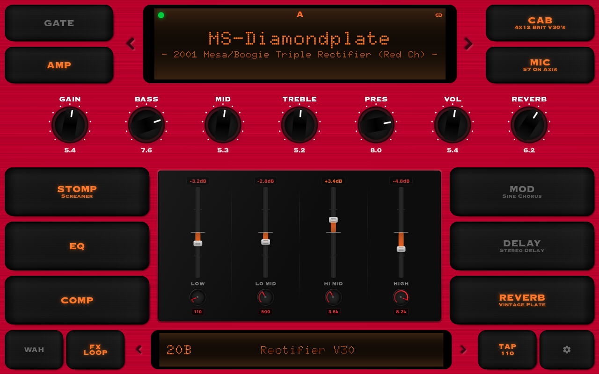</td>
      <td width="25%">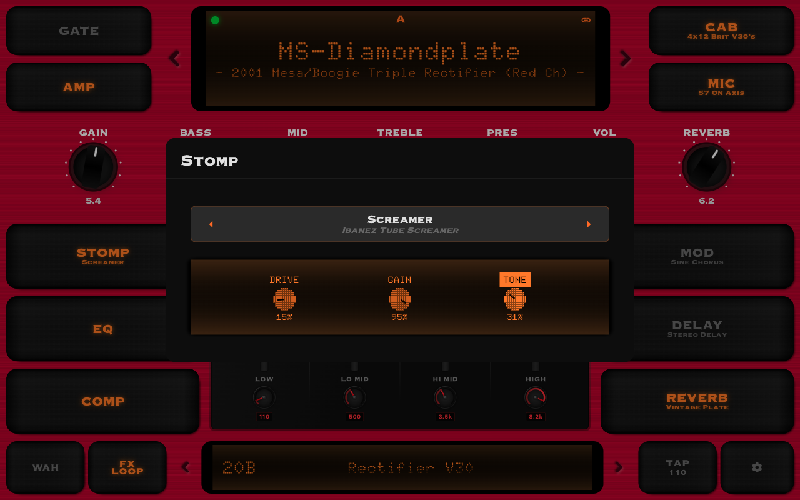</td>
      <td width="25%">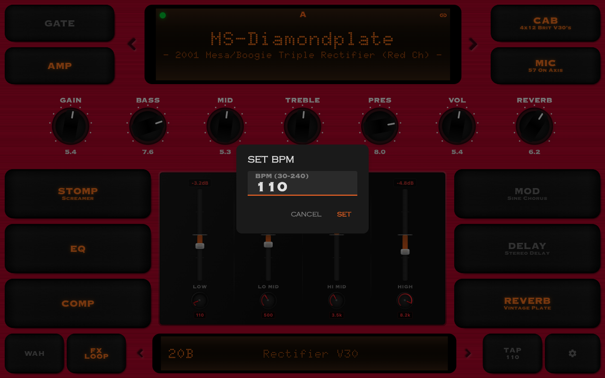</td>
      <td width="25%">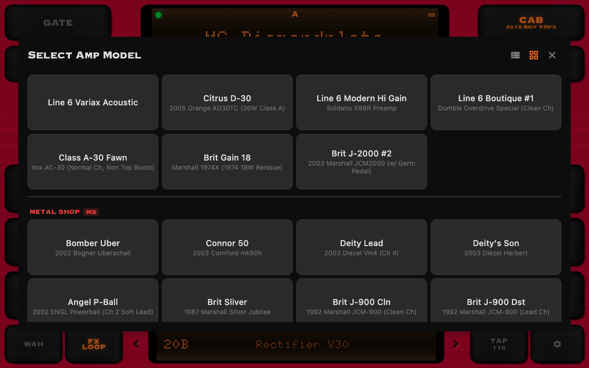</td>
    </tr>
    <tr>
      <td width="25%">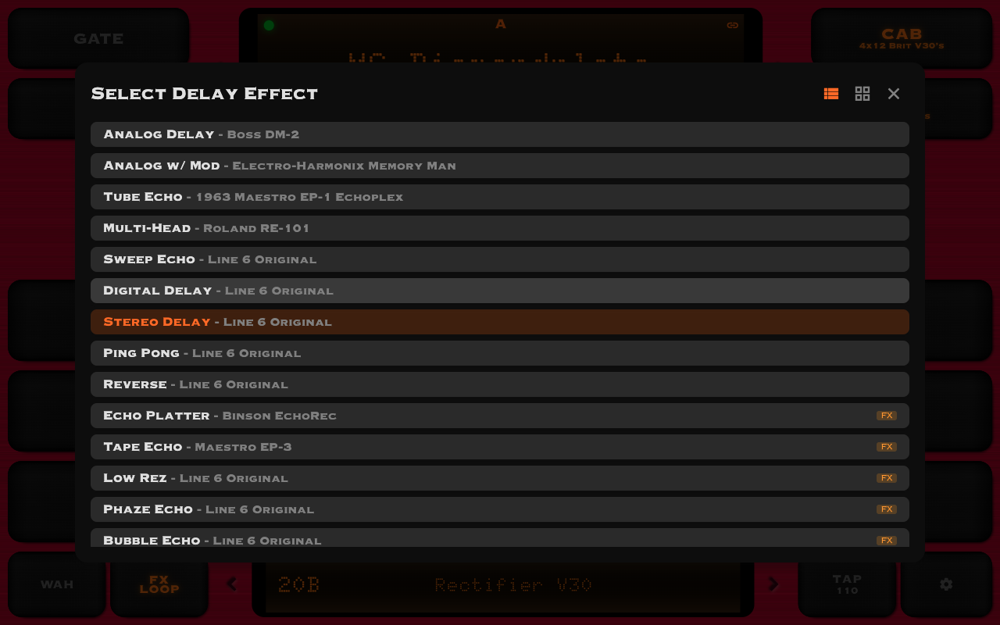</td>
      <td width="25%">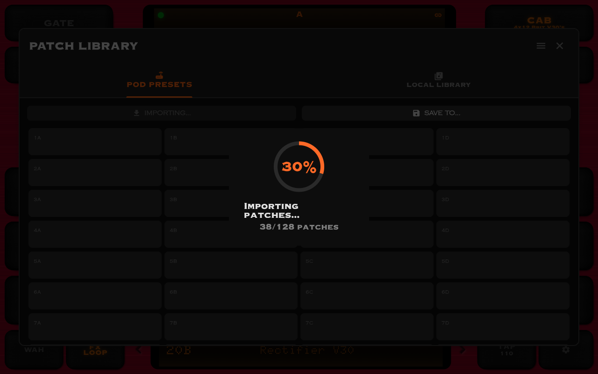</td>
      <td width="25%"></td>
      <td width="25%">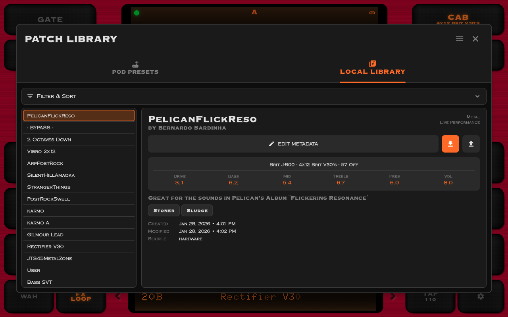</td>
    </tr>
    <tr>
      <td width="25%">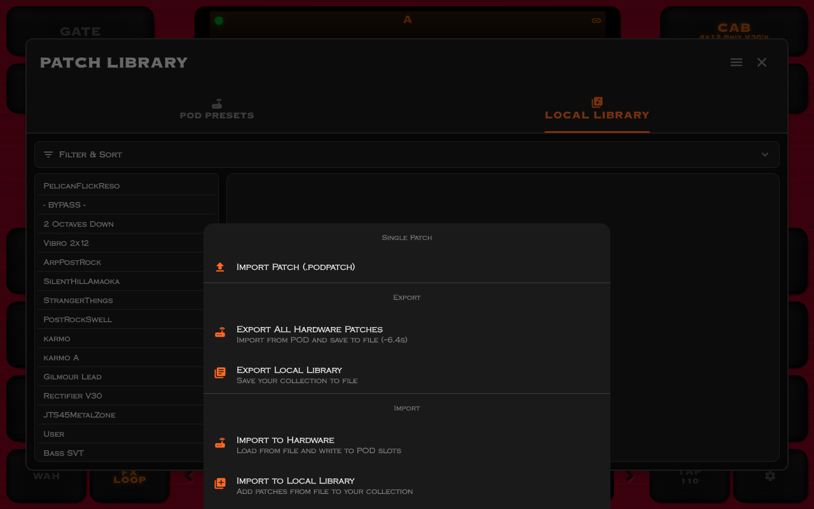</td>
      <td width="25%">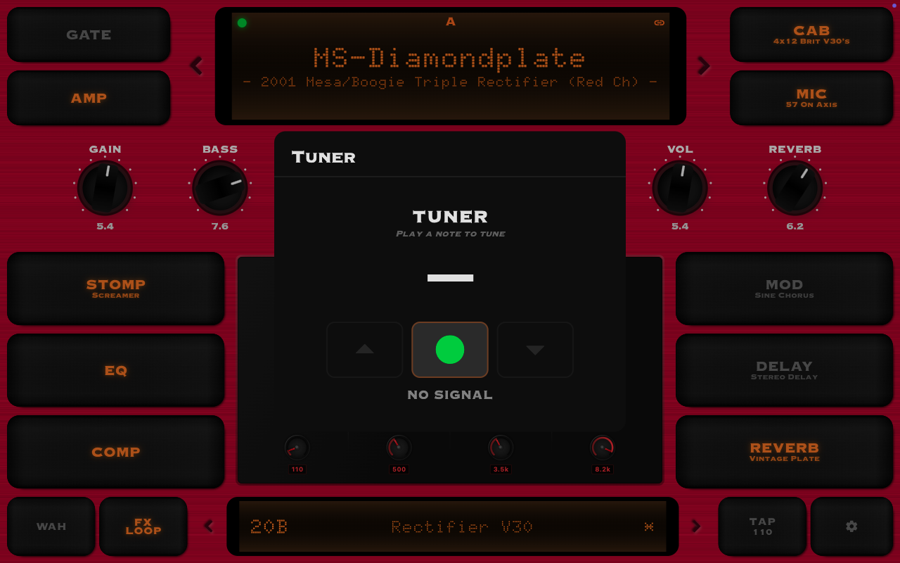</td>
      <td width="25%">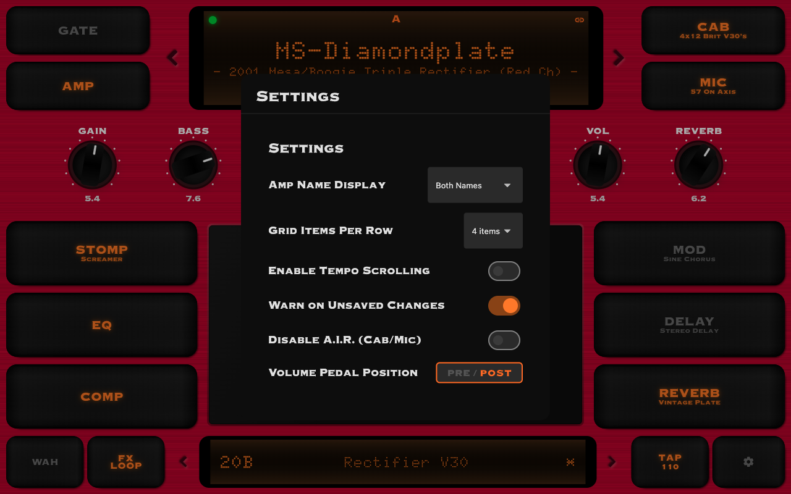</td>
      <td width="25%">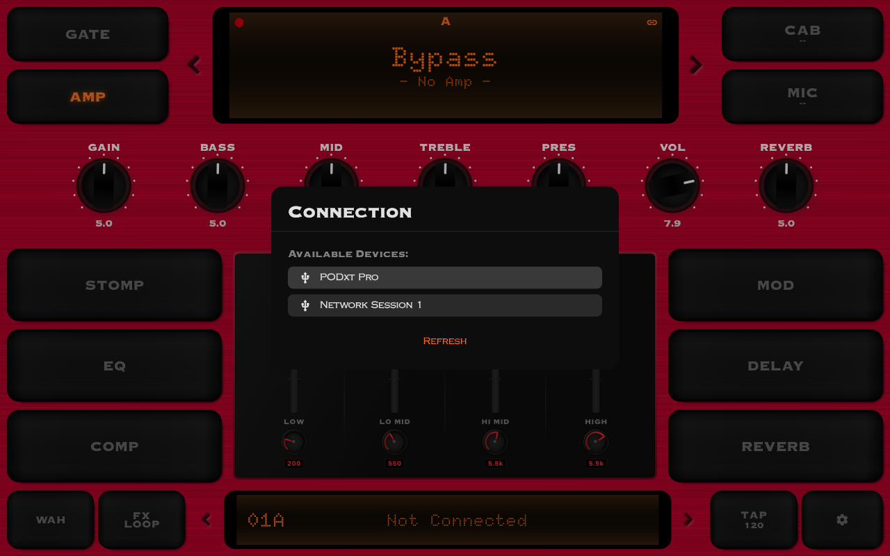</td>
    </tr>
  </table>
</div>

---

## Requirements

### Hardware

- **Line 6 POD XT Pro** (this app is specifically for POD XT Pro, NOT other POD models)
- **BT-MIDI Adapter** (e.g., CME WIDI Master, Yamaha MD-BT01) for wireless connection OR
- **USB MIDI Connection**:
  - iOS/macOS: Camera Connection Kit or direct USB-C
  - Android: USB OTG cable
  - Windows: Direct USB connection with official Line 6 drivers

### Software

- **iOS**: 12.0 or later
- **Android**: 5.0 (API 21) or later
- **macOS**: 10.14 or later
- **Windows**: 10 or later (USB MIDI only)

---

## Installation

### macOS (DMG)

1. Download the latest DMG from [Releases](https://github.com/bhsardinha/pod_flutter/releases)
2. Open the DMG file
3. Drag **POD Flutter.app** to the **Applications** folder
4. Launch from Applications (right-click → Open on first launch to bypass Gatekeeper)

### iOS (via TestFlight)

*TestFlight distribution coming soon. For now, please build from source.*

### Android (APK)

1. Download the latest APK from [Releases](https://github.com/bhsardinha/pod_flutter/releases)
2. Enable "Install from Unknown Sources" in Android settings
3. Install the APK

### Build from Source

```bash
# Clone repository
git clone https://github.com/bhsardinha/pod_flutter.git
cd pod_flutter

# Install dependencies
flutter pub get

# Run on connected device
flutter run

# Or build release
flutter build apk        # Android
flutter build ios        # iOS
flutter build macos      # macOS
flutter build windows    # Windows
```

---

## Quick Start

1. **Connect Hardware**:
   - Power on your POD XT Pro
   - Connect BT-MIDI adapter to POD MIDI port (or use USB MIDI)
   - Ensure adapter is discoverable (check adapter manual)

2. **Launch App**:
   - Open POD Flutter
   - Tap connection icon (top-left)
   - Select your MIDI device from the list
   - Tap "Connect"

3. **Load Patches** (Optional):
   - Tap "Import All Patches" to sync entire patch library (~6 seconds)
   - Or just use edit buffer (current patch loads automatically)

4. **Start Playing**:
   - Turn knobs to adjust parameters
   - Tap effect buttons to enable/disable effects
   - Use patch browser to load different patches
   - Save changes to hardware via patch list modal

---

## Usage

### Main Screen

The main screen mimics the POD XT Pro hardware interface with authentic rotary knobs, LCD displays, and LED indicators.

### Controls

- **Rotary Knobs**: Drag vertically to adjust value
- **Effect Buttons**: Tap to toggle on/off, long-press/right-click to edit parameters
- **Patch Browser**: Tap patch name to open 128-patch browser
- **Tap Tempo**: Tap button to set tempo
- **Settings**: Amp name display mode, UI preferences

### Amp Selection

Tap the amp name to open amp selector:
- **List View** or **Grid View** (toggle in top-right)
- **Filter by Pack**: All, Stock, MS, CC, BX
- **Display Modes**: Factory names, Real amp names, or Both
- **Load Options**: Load with defaults or preserve current settings

### Effects

Tap any effect button to open effect editor:
- **Model Selection**: Choose from available models
- **Dynamic Parameters**: Knobs change based on selected model
- **Tempo Sync**: Enable tempo sync for Mod/Delay (note divisions)
- **Enable/Bypass**: Toggle effect on/off

### Patch Management

Tap patch name to open patch browser:
- **Browse**: All 128 patches organized by bank (A/B/C/D)
- **Load**: Tap patch to load to edit buffer
- **Save**: Long-press patch to save current edit buffer
- **Modified Indicator**: Shows which patches have been edited

---

## Documentation

Comprehensive documentation is available in the `/docs/` folder:

- **[ARCHITECTURE.md](docs/ARCHITECTURE.md)** - System design, layers, data flow
- **[PROTOCOL.md](docs/PROTOCOL.md)** - MIDI protocol reference
- **[FEATURES.md](docs/FEATURES.md)** - Feature list, limitations, roadmap
- **[POD_XT_PRO_DIFFERENCES.md](docs/POD_XT_PRO_DIFFERENCES.md)** - POD XT Pro specifics
- **[CLAUDE.md](CLAUDE.md)** - Developer guide (for Claude Code)

---

## Known Limitations

### Hardware Limitations

- **Bulk Import Speed**: Takes ~6.4 seconds to import all 128 patches (hardware limitation)
- **No Bulk Dump**: POD XT Pro doesn't support bulk dump; must request patches individually
- **Response Delays**: Hardware requires 50ms delay between patch requests

### Software Limitations

- **No Patch Caching**: Patches must be re-imported on each app launch (not needed if just control is intended)
- **Landscape Only**: Portrait mode not supported (planned feature)

See [FEATURES.md](docs/FEATURES.md) for complete list.

---

## Troubleshooting

### Wrong Patches Loading

1. **CRITICAL**: Verify you're using POD XT Pro (NOT POD XT or other model)
2. This app is specifically for POD XT Pro and won't work correctly with other models

### Corrupted Patches After Import

1. **CRITICAL**: Verify device is POD XT Pro (160-byte patches)
2. POD XT (non-Pro) uses 152-byte patches and is NOT compatible (needs a different implementation)

See [PROTOCOL.md](docs/PROTOCOL.md) for more troubleshooting.

---

## Contributing

Contributions are welcome! Please read the documentation first:

1. **Fork the repository** and create your branch from `main`
2. **Read the docs**: [ARCHITECTURE.md](docs/ARCHITECTURE.md) and [POD_XT_PRO_DIFFERENCES.md](docs/POD_XT_PRO_DIFFERENCES.md)
3. **Make your changes**: Follow existing code style and conventions
4. **Test thoroughly**: Test on real POD XT Pro hardware (not just emulator)
5. **Don't break critical features**: Especially sysex handling and protocol quirks
6. **Submit a pull request**: Describe your changes clearly

See [CLAUDE.md](CLAUDE.md) for detailed developer guide.

### Reporting Issues

Found a bug or have a feature request? Please [open an issue](https://github.com/bhsardinha/pod_flutter/issues) with:
- Clear description of the problem/request
- Steps to reproduce (for bugs)
- Your device and OS version
- POD XT Pro firmware version (if applicable)

---

## Technical Details

### Architecture

- **Platform**: Flutter (Dart)
- **MIDI Library**: flutter_midi_command
- **Architecture**: Layered (Protocol → Services → UI)
- **State Management**: Stream-based reactive architecture
- **Patch Size**: 160 bytes (POD XT Pro specific)
- **Protocol**: Line 6 sysex + standard MIDI CC

### Key Components

- **PodController**: High-level POD API
- **BleMidiService**: BLE/USB MIDI implementation
- **Protocol Layer**: CC map, sysex builders/parsers (5 files)
- **Models**: Patch, EditBuffer, PatchLibrary, Amp/Cab/Effect models
- **UI**: 35 widgets/screens/modals

See [ARCHITECTURE.md](docs/ARCHITECTURE.md) for complete details.

---

## Credits

### Development

**This entire codebase was developed using [Claude Code](https://claude.ai/code)** - Anthropic's AI-powered coding assistant. From architecture design to protocol implementation to UI development, every line of code was collaboratively written through natural language conversation with Claude.

This project demonstrates the power of AI-assisted development for complex, specialized domains like reverse-engineered hardware protocols.

### Spinoff Project

**POD Flutter is a spinoff of [pod-ui](https://github.com/arteme/pod-ui)** by [arteme](https://github.com/arteme) - a Rust/GTK desktop application for POD XT/XT Pro.

While pod-ui takes a **lean, lightweight "all-in-one-screen" approach**, POD Flutter reimagines the interface with a **quasi-skeumorphic design** that closely mimics the physical hardware. Both projects share the same protocol implementation knowledge, but offer different user experience philosophies:

- **pod-ui**: Efficient, minimalist, all controls visible at once
- **POD Flutter**: Hardware-authentic, with rotary knobs, LCD screens, and physical-style navigation

The pod-ui project was essential for understanding POD XT Pro's MIDI protocol quirks and behavior.

### Dependencies

- [flutter_midi_command](https://pub.dev/packages/flutter_midi_command) - BLE/USB MIDI support
- [shared_preferences](https://pub.dev/packages/shared_preferences) - Settings persistence

### Fonts

- **Doto** - LCD displays
- **OPTICopperplate** - UI labels

---

## License

MIT License - See [LICENSE](LICENSE) file for details.

**Note**: This project implements the POD XT Pro MIDI protocol based on analysis of the [pod-ui](https://github.com/arteme/pod-ui) reference implementation (GPL v3). While this is an independent implementation that doesn't contain copied code, it was developed with knowledge gained from studying pod-ui's protocol implementation.

---

## Disclaimer

This software is not affiliated with, endorsed by, or sponsored by Line 6 or Yamaha Corporation. Line 6 and POD are registered trademarks of Yamaha Corporation.

This is an independent, reverse-engineered implementation based on publicly available information and the open-source pod-ui reference implementation.

Use at your own risk. The authors are not responsible for any damage to hardware or data.

---

## Acknowledgments

Special thanks to:
- **[Anthropic](https://anthropic.com)** for Claude Code - this project wouldn't exist without it
- **[arteme](https://github.com/arteme)** for the pod-ui reference implementation
- The **Flutter community** for excellent libraries and support
- **Line 6** for creating the POD XT Pro (even if they never released full sysex docs!)
